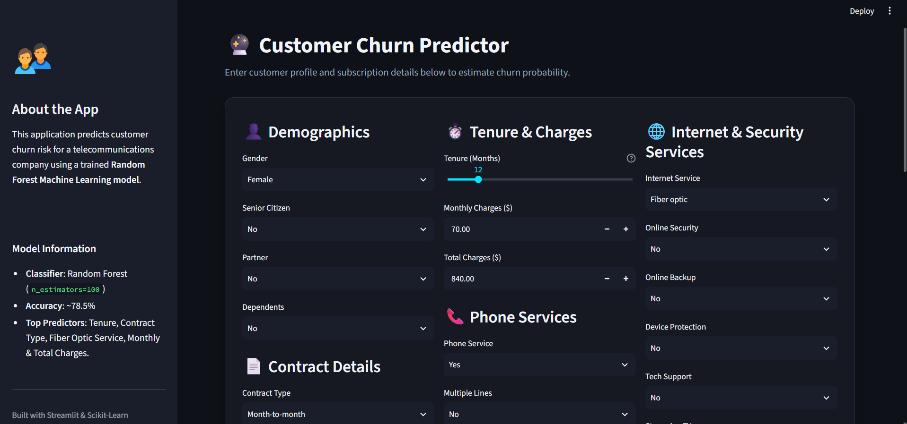
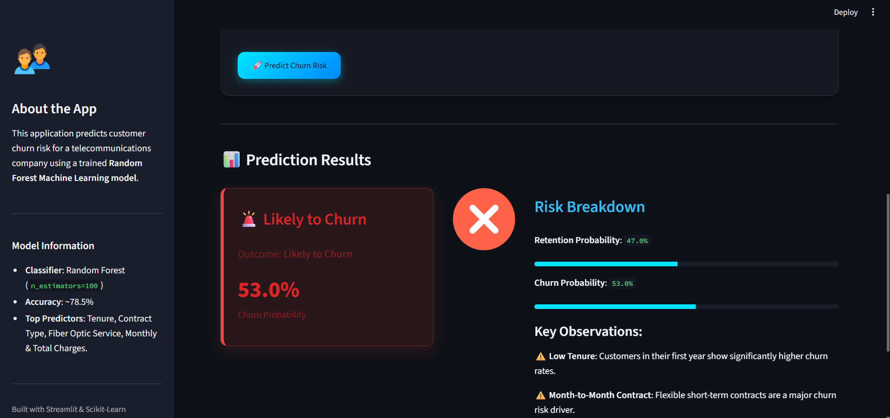

# 🔮 Customer Churn Predictor

An interactive end-to-end Machine Learning web application that predicts customer churn risk for telecommunications subscribers using a trained **Random Forest Classifier** and **Streamlit**.

---

## 🚀 Live Demo

👉 [Try the Churn Predictor](https://churn-predictor-jqkgtxnd5fyfptanateypp.streamlit.app/)

---

## 📌 Problem Statement

Customer churn poses a critical financial challenge for telecommunications companies, as acquiring a new subscriber costs up to five times more than retaining an existing customer. Identifying subscribers who are at high risk of canceling their service allows business teams to intervene early with targeted retention offers, contract incentives, and personalized support before cancellation occurs.

---

## 📊 Dataset Overview

* **Source**: [Telco Customer Churn Dataset on Kaggle](https://www.kaggle.com/datasets/blastchar/telco-customer-churn) (IBM Sample Data)
* **Dataset Size**: 7,043 rows & 21 columns
* **Target Variable**: `Churn` (`Yes` / `No`)
* **Class Distribution**:
  * **Not Churned (0)**: 5,174 subscribers (~73.5%)
  * **Churned (1)**: 1,869 subscribers (~26.5%)

---

## 🛠️ Data Pipeline & Methodology

1. **Data Cleaning**:
   * Converted `TotalCharges` from string to numeric type.
   * Handled 11 blank entries corresponding to new subscribers (`tenure = 0`) by dropping them (resulting in 7,032 clean rows with < 0.2% data loss).
2. **Feature Engineering & Encoding**:
   * Mapped binary categories (`Partner`, `Dependents`, `PhoneService`, `PaperlessBilling`) to `0` and `1`.
   * Performed One-Hot Encoding (`pd.get_dummies`) on nominal categorical variables (`Contract`, `PaymentMethod`, `InternetService`, etc.).
   * Verified zero target leakage between features ($X$) and target ($y$).
3. **Train-Test Split**:
   * Split data into **80% Training** (5,625 rows) and **20% Testing** (1,407 rows) sets with fixed random seed (`random_state=42`).
4. **Model Training & Evaluation**:
   * Trained baseline **Logistic Regression** and **Random Forest Classifier** (`n_estimators=100`).

---

## 📈 Model Performance & Comparison

| Metric | Logistic Regression | Random Forest (Selected Model) |
| :--- | :---: | :---: |
| **Overall Accuracy** | **78.75%** | **78.54%** |
| **Precision (Churn = 1)** | 62.06% | **62.68%** |
| **Recall (Churn = 1)** | **51.60%** | 47.59% |
| **F1-Score (Churn = 1)** | **56.35%** | 54.10% |
| **Precision (Stay = 0)** | 83.49% | **82.55%** |
| **Recall (Stay = 0)** | 88.58% | **89.74%** |
| **F1-Score (Stay = 0)** | 85.96% | **85.99%** |

---

## 🔍 Key SHAP Model Insights

Using **SHAP (SHapley Additive exPlanations)** to interpret model predictions, the top feature drivers influencing customer churn risk are:

1. **Subscription Tenure (`tenure`)**: Low tenure (first 12 months) is the single strongest predictor of customer churn. Subscribers past 48 months demonstrate significantly higher retention stability.
2. **Fiber Optic Internet Service (`InternetService_Fiber optic`)**: Subscribers with Fiber Optic service show a noticeably higher propensity to churn compared to DSL subscribers, likely driven by competitive pricing or service expectations.
3. **Contract Commitment (`Contract_Two year` / `Contract_One year`)**: Two-year and one-year contract commitments act as the strongest protective factor against churn, drastically reducing cancellation probability compared to flexible Month-to-Month plans.

---

## 🖥️ Application UI Preview

Below is a preview of the interactive Streamlit application featuring dark mode, custom UI container cards, dynamic loading state, and smooth fade-in result animations:

1. **🏠 Initial Screen**


2. **🔮 Prediction Screen**


---

## 🚀 How to Run Locally

### Prerequisites
* Python 3.9+ installed on your system.

### Installation Steps

1. **Clone the repository**:
   ```bash
   git clone https://github.com/your-username/churn-predictor.git
   cd churn-predictor
   ```

2. **Install dependencies**:
   ```bash
   pip install -r requirements.txt
   ```

3. **Run the Streamlit App**:
   ```bash
   streamlit run app.py
   ```

4. **Access the application**:
   Open your browser and navigate to `http://localhost:8501`.

---

## 📂 Project Structure

```
churn-predictor/
├── .streamlit/
│   └── config.toml          # Custom dark theme configuration
├── data/
│   └── WA_Fn-UseC_-Telco-Customer-Churn.csv # Dataset
├── app.py                   # Streamlit web application
├── model.pkl                # Trained Random Forest model
├── model_columns.pkl        # Encoded feature column alignment list
├── notebook.ipynb           # Model development & EDA notebook
├── requirements.txt         # Project dependencies
└── README.md                # Project documentation
```
